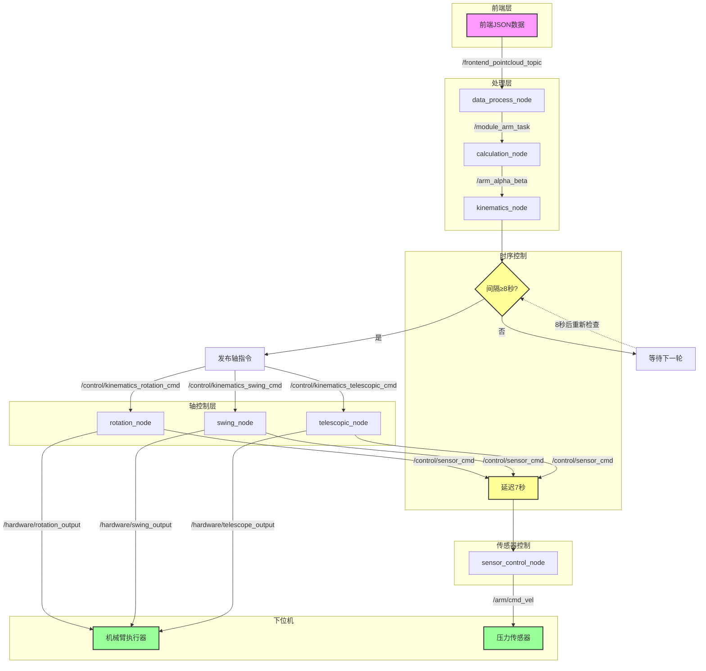
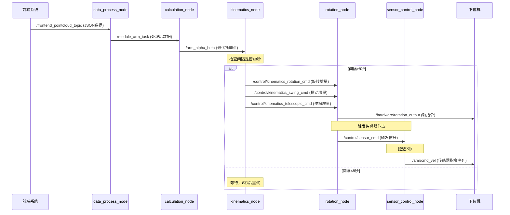
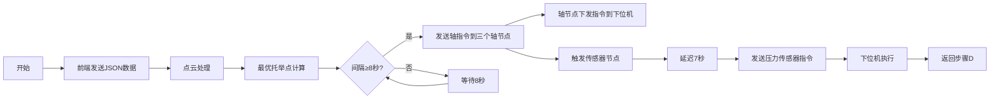

# robot_control_backend 整体流程图

## 🔄 数据流流程图

## ⏱️ 时序图

## 📊 节点职责表

| 节点名称 | 核心职责 | 发布话题 | 订阅话题 |
|---------|---------|---------|---------|
| `data_process_node` | 点云数据处理 | `/module_arm_task` | `/frontend_pointcloud_topic` |
| `calculation_node` | 最优托举点计算 | `/arm_alpha_beta` | `/module_arm_task` |
| `kinematics_node` | 运动学解算+8秒间隔控制 | `/control/kinematics_*_cmd` | `/arm_alpha_beta` |
| `rotation_node` | 旋转轴控制 | `/hardware/rotation_output` | `/control/kinematics_rotation_cmd` |
| `swing_node` | 摆动轴控制 | `/hardware/swing_output` | `/control/kinematics_swing_cmd` |
| `telescopic_node` | 伸缩轴控制 | `/hardware/telescope_output` | `/control/kinematics_telescopic_cmd` |
| `sensor_control_node` | 压力传感器控制(7秒延迟) | `/arm/cmd_vel` | `/control/sensor_cmd` |

## ⚙️ 时序参数配置

| 参数 | 值 | 配置位置 | 作用 |
|------|-----|---------|------|
| `CYCLE_INTERVAL` | 8.0s | `rob_arm.env` | 每个机械臂的轴指令间隔 |
| `SENSOR_DELAY` | 7.0s | `rob_arm.env` | 轴指令后延迟发送传感器指令 |

## 🔍 执行流程图

## 📝 运行逻辑总结

1. **前端输入**：发送JSON格式的点云数据到 `/frontend_pointcloud_topic`
2. **点云处理**：`data_process_node` 处理后发布到 `/module_arm_task`
3. **最优计算**：`calculation_node` 计算最优托举点发布到 `/arm_alpha_beta`
4. **运动学解算**：`kinematics_node` 进行运动学解算，**每8秒发送一条轴指令**
5. **轴控制**：三个轴节点接收指令并下发到下位机
6. **传感器触发**：轴节点发布触发信号到 `/control/sensor_cmd`
7. **延迟发送**：`sensor_control_node` 收到触发后**延迟7秒**发送压力传感器指令
8. **循环执行**：持续监听新指令，重复上述流程
