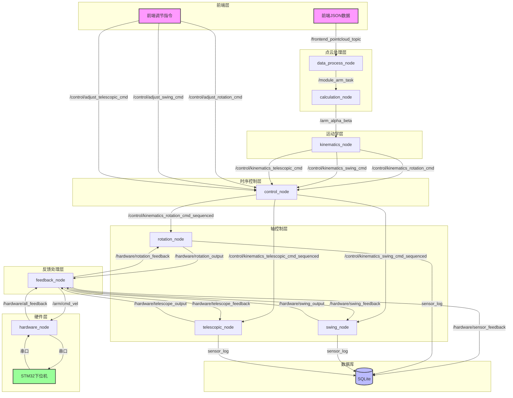
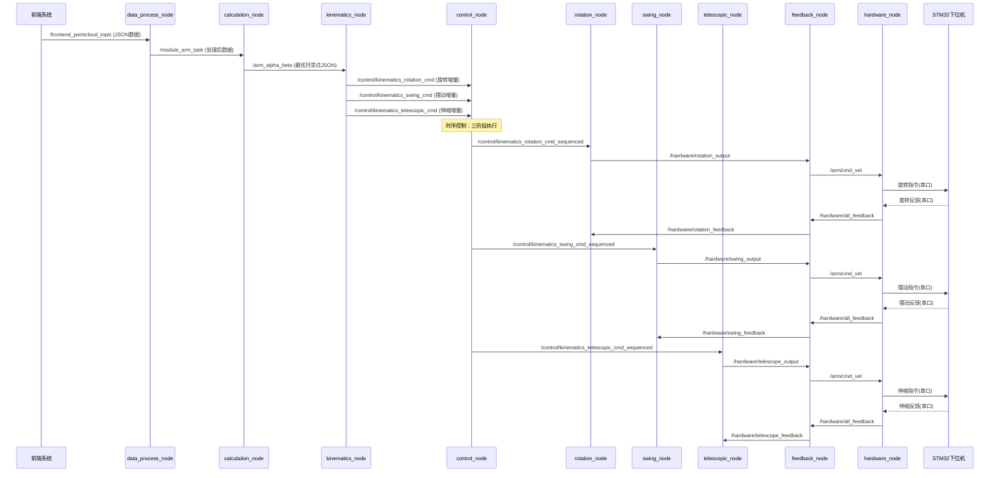
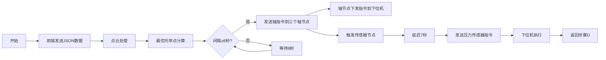

# robot_control_backend 整体流程图

## 🔄 数据流流程图

```mermaid
flowchart TD
    subgraph 前端层
        A[前端JSON数据]
        A2[前端调节指令]
    end
    
    subgraph 点云处理层
        B[data_process_node]
        C[calculation_node]
    end
    
    subgraph 运动学层
        D[kinematics_node]
    end
    
    subgraph 时序控制层
        E[control_node]
    end
    
    subgraph 轴控制层
        F[rotation_node]
        G[swing_node]
        H[telescopic_node]
    end
    
    subgraph 反馈处理层
        I[feedback_node]
    end
    
    subgraph 硬件层
        J[hardware_node]
        K[STM32下位机]
    end
    
    subgraph 数据库
        L[(SQLite)]
    end

    %% 主数据流：点云→处理→运动学→时序→轴控制→硬件
    A -->|/frontend_pointcloud_topic| B
    B -->|/module_arm_task| C
    C -->|/arm_alpha_beta| D
    D -->|/control/kinematics_rotation_cmd| E
    D -->|/control/kinematics_swing_cmd| E
    D -->|/control/kinematics_telescopic_cmd| E
    
    %% 时序控制：三阶段执行
    E -->|/control/kinematics_rotation_cmd_sequenced| F
    E -->|/control/kinematics_swing_cmd_sequenced| G
    E -->|/control/kinematics_telescopic_cmd_sequenced| H
    
    %% 轴节点→反馈节点→硬件
    F -->|/hardware/rotation_output| I
    G -->|/hardware/swing_output| I
    H -->|/hardware/telescope_output| I
    I -->|/arm/cmd_vel| J
    J -->|串口| K
    
    %% 前端微调指令
    A2 -->|/control/adjust_rotation_cmd| E
    A2 -->|/control/adjust_swing_cmd| E
    A2 -->|/control/adjust_telescopic_cmd| E
    
    %% 硬件反馈
    K -->|串口| J
    J -->|/hardware/all_feedback| I
    I -->|/hardware/rotation_feedback| F
    I -->|/hardware/swing_feedback| G
    I -->|/hardware/telescope_feedback| H
    I -->|/hardware/sensor_feedback| L
    
    %% 数据存储
    F -->|sensor_log| L
    G -->|sensor_log| L
    H -->|sensor_log| L

    %% 样式
    style A fill:#f9f,stroke:#333,stroke-width:2px
    style A2 fill:#f9f,stroke:#333,stroke-width:2px
    style K fill:#9f9,stroke:#333,stroke-width:2px
    style L fill:#bbf,stroke:#333,stroke-width:2px
```

## ⏱️ 时序图

```mermaid
sequenceDiagram
    participant 前端 as 前端系统
    participant DP as data_process_node
    participant CAL as calculation_node
    participant KIN as kinematics_node
    participant CTRL as control_node
    participant ROT as rotation_node
    participant SW as swing_node
    participant TEL as telescopic_node
    participant FB as feedback_node
    participant HW as hardware_node
    participant STM as STM32下位机

    前端->>DP: /frontend_pointcloud_topic (JSON数据)
    DP->>CAL: /module_arm_task (处理后数据)
    CAL->>KIN: /arm_alpha_beta (最优托举点JSON)
    
    KIN->>CTRL: /control/kinematics_rotation_cmd (旋转增量)
    KIN->>CTRL: /control/kinematics_swing_cmd (摆动增量)
    KIN->>CTRL: /control/kinematics_telescopic_cmd (伸缩增量)
    
    Note over CTRL: 时序控制：三阶段执行
    
    CTRL->>ROT: /control/kinematics_rotation_cmd_sequenced
    ROT->>FB: /hardware/rotation_output
    FB->>HW: /arm/cmd_vel
    HW->>STM: 旋转指令(串口)
    STM-->>HW: 旋转反馈(串口)
    HW->>FB: /hardware/all_feedback
    FB->>ROT: /hardware/rotation_feedback
    
    CTRL->>SW: /control/kinematics_swing_cmd_sequenced
    SW->>FB: /hardware/swing_output
    FB->>HW: /arm/cmd_vel
    HW->>STM: 摆动指令(串口)
    STM-->>HW: 摆动反馈(串口)
    HW->>FB: /hardware/all_feedback
    FB->>SW: /hardware/swing_feedback
    
    CTRL->>TEL: /control/kinematics_telescopic_cmd_sequenced
    TEL->>FB: /hardware/telescope_output
    FB->>HW: /arm/cmd_vel
    HW->>STM: 伸缩指令(串口)
    STM-->>HW: 伸缩反馈(串口)
    HW->>FB: /hardware/all_feedback
    FB->>TEL: /hardware/telescope_feedback
```

## 📊 节点职责表

| 节点名称 | 核心职责 | 发布话题 | 订阅话题 |
|---------|---------|---------|---------|
| `data_process_node` | 点云数据处理与模块切分 | `/module_arm_task` | `/frontend_pointcloud_topic` |
| `calculation_node` | 最优托举点计算 | `/arm_alpha_beta`, `/arm_fusion_stats` | `/module_arm_task` |
| `kinematics_node` | 运动学逆解与增量计算 | `/control/kinematics_rotation_cmd`, `/control/kinematics_swing_cmd`, `/control/kinematics_telescopic_cmd` | `/arm_alpha_beta`, `/hardware/*_feedback` |
| `control_node` | 时序控制核心（三阶段执行） | `/control/kinematics_*_cmd_sequenced`, `/control/adjust_*_cmd_sequenced` | `/control/kinematics_*_cmd`, `/control/adjust_*_cmd` |
| `rotation_node` | 旋转轴角度控制与限位保护 | `/hardware/rotation_output`, `/control/sensor_cmd` | `/control/kinematics_rotation_cmd_sequenced`, `/hardware/rotation_feedback` |
| `swing_node` | 摆动轴角度控制与限位保护 | `/hardware/swing_output`, `/control/sensor_cmd` | `/control/kinematics_swing_cmd_sequenced`, `/hardware/swing_feedback` |
| `telescopic_node` | 伸缩轴长度控制与压力监控 | `/hardware/telescope_output`, `/control/sensor_cmd` | `/control/kinematics_telescopic_cmd_sequenced`, `/hardware/telescope_feedback` |
| `feedback_node` | 硬件反馈解析与指令转发 | `/arm/cmd_vel`, `/hardware/*_feedback`, `/hardware/sensor_feedback` | `/hardware/all_feedback`, `/hardware/*_output` |
| `hardware_node` | STM32串口通信与数据解析 | `/hardware/all_feedback`, `/hardware/gyroscope_feedback` | `/arm/cmd_vel` |

## ⚙️ 时序参数配置

| 参数 | 值 | 配置位置 | 作用 |
|------|-----|---------|------|
| `CYCLE_INTERVAL` | 8.0s | `rob_arm.env` | 每个机械臂的轴指令间隔 |
| `SENSOR_DELAY` | 7.0s | `rob_arm.env` | 轴指令后延迟发送传感器指令 |

## 🔍 执行流程图

```mermaid
flowchart LR
    A[开始] --> B[前端发送JSON数据]
    B --> C[点云处理]
    C --> D[最优托举点计算]
    D --> E{间隔≥8秒?}
    E -->|是| F[发送轴指令到三个轴节点]
    E -->|否| G[等待8秒]
    G --> E
    F --> H[轴节点下发指令到下位机]
    F --> I[触发传感器节点]
    I --> J[延迟7秒]
    J --> K[发送压力传感器指令]
    K --> L[下位机执行]
    L --> M[返回步骤D]
```

## 📝 运行逻辑总结

1. **前端输入**：发送JSON格式的点云数据到 `/frontend_pointcloud_topic`
2. **点云处理**：`data_process_node` 处理后发布到 `/module_arm_task`
3. **最优计算**：`calculation_node` 计算最优托举点发布到 `/arm_alpha_beta`
4. **运动学解算**：`kinematics_node` 进行运动学解算，**每8秒发送一条轴指令**
5. **轴控制**：三个轴节点接收指令并下发到下位机
6. **传感器触发**：轴节点发布触发信号到 `/control/sensor_cmd`
7. **延迟发送**：`sensor_control_node` 收到触发后**延迟7秒**发送压力传感器指令
8. **循环执行**：持续监听新指令，重复上述流程
